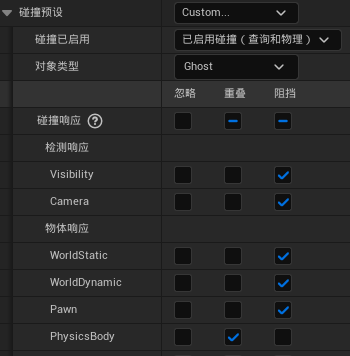
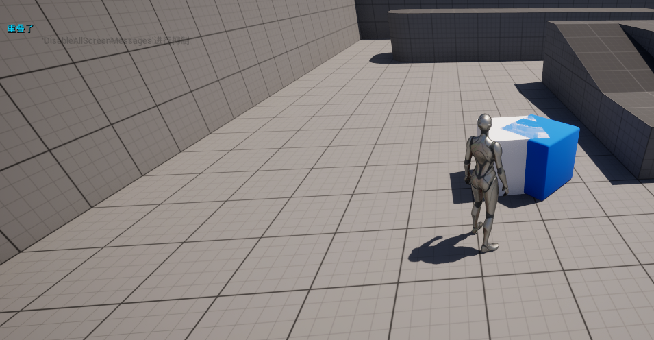
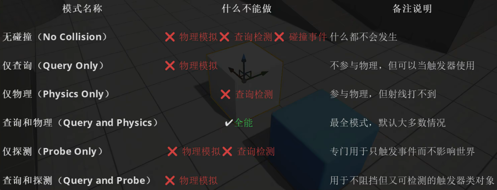

# 碰撞

## 碰撞响应
不同对象类型的碰撞响应：

忽略>重叠>阻挡
- 阻挡优先级最低，所以阻挡的发生需要双方都是“阻挡”状态
- 重叠和忽略的唯一区别就是重叠事件

### 重叠事件
- 重叠事件要求双方都启用“生成重叠事件”，且至少一方为重叠状态
- 只要一方为忽略状态，则不会发生阻挡和重叠

### 命中事件
- 命中事件要求双方互相为阻挡状态，且成功阻挡（发生碰撞）
- 当阻挡发生时，只需一方开启生成命中事件，即可触发命中事件

## 通道

